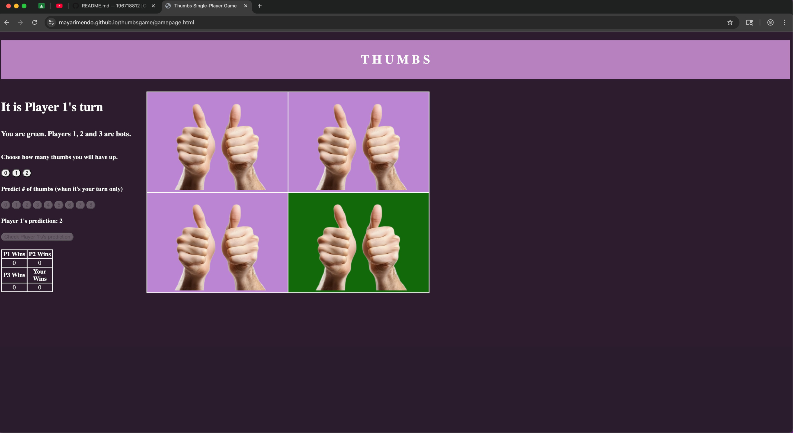

![Screenshot1] (Gamescreenshot1.png)

# Thumbs Single-Player Game
>The Thumbs Single-Player Game website is the online version of a multiplayer game.
The original game takes any number of people and is a game of predictions.
Each 'player' takes turns guessing the number of thumbs they predict will be up.
Each round, every player chooses the number of thumbs they will display.
If the current player's prediction matches the total number of thumbs displayed, that player will earn a win.
If a player has 2 wins, they win the game.
In this version of the game, there are four players, and the user is playing against 3 bots, or a player that does automated tasks.
The purpose of the Thumbs Single-Player Game is to allow a single player, the user, to play the thumbs game alone, in the absence of other *real* players to play against.

>[Video explanation](https://youtu.be/a_km1-Mxofg)

>So what does the user do in the game?
In the online single-player version, the user can, at any given time, select the number of thumbs they will have up before checking if the bot or user prediction is correct.
The user can also select their own prediction for the number of thumbs that will be up *when it is their turn*.
When it's not the user's turn, the button for the user to make a prediction will be disabled.
>>Typed instructions for how to play the game are included on the start page for the user to view.
However, if the user wishes to skip the instructions, the "START" button is active.

### The file structure of the game is as follows:
 - index.html
    - "start" webpage that has instructions for the game and how it's played
 - script.js
    - script for index.html: displays the instructions and lets the user proceed to the game page
 - gamepage.html
    - webpage that displays the full game
 - gamescript.js
    - script for gamepage.html: runs the game, including creating turns, running rounds, and determining a winner
 - styles.css
    - provides the styling for index.html AND gamepage.html

>*Credits/Resources*
>>Resources used include the CS50 Debugger Duck for general queries and Chat GPT for specific questions.
Use of Chat GPT(also commented in code):
>>> thinking through logic for looping turns in gamescript.js,
help with knowing how to implement array of key:value pairs instead of using two separate arrays,
help with how to use modulo to loop through players

